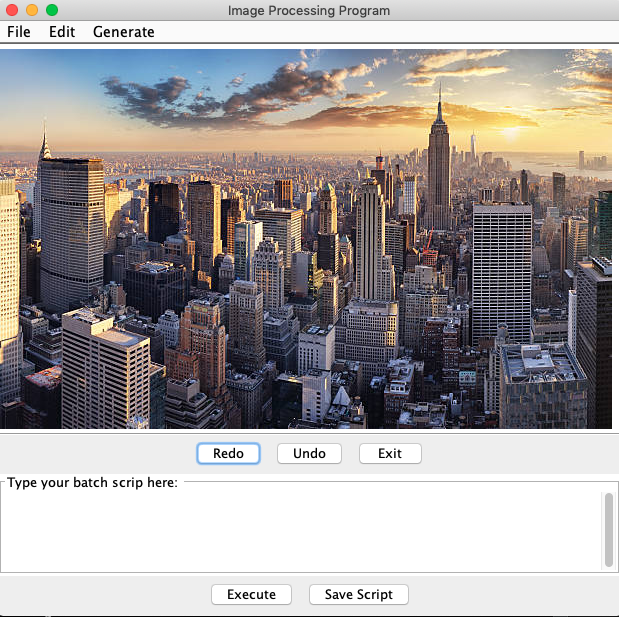
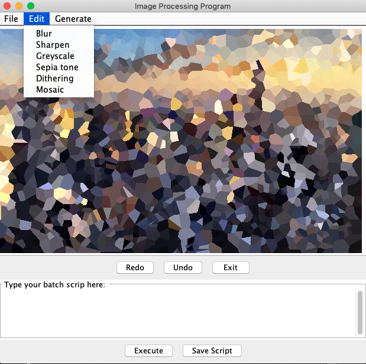
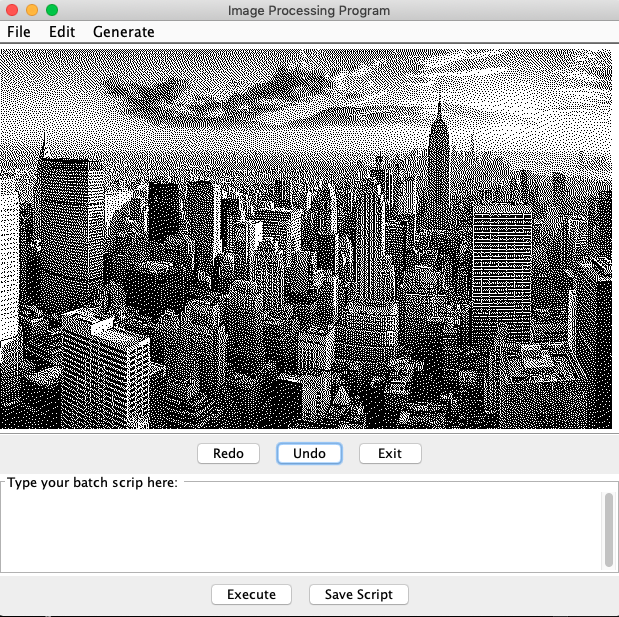

# Imagen

## Description 

Imager is a program created for Northeastern University’s CS-5004 Object Oriented Design course, a part of the Align MSCS program. Imager is a program that takes an image or creates an image and performs an operation on the image’s pixels to produce a desired outcome. This README is specifically written for part two. 

This is the third release of the Imager program. The Imager program now includes a model, controller and view (new with this release). As with the previous release, the user can use the command line interface to start the program that allows the user to send a file directly to the controller. In keeping up with solid design principles, we kept everything (mostly) the same. You can read more about what changes me made and did not make in the changelog below. 

To start this program using the GUI, run the JAR file included in the res/ folder of this submission with -interactive (See last sentence of this paragraph). After a moment, the GUI will start right up. The interactive controller is called with the following script: java -jar Program.jar -interactive.

### Examples

  

<h5 align="center">Original NYC photography</h5>

$~~~~~~~$

  

<h5 align="center">Mozaic filter</h5>

$~~~~~~~$

  

<h5 align="center">Blur filer</h5>

$~~~~~~~$

  

<h5 align="center">Dithering filer</h5>

